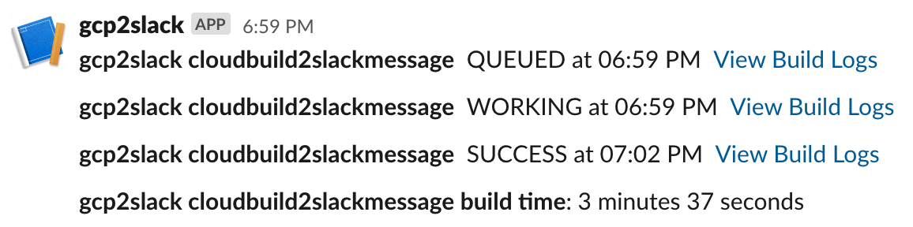

# cloudbuild2slackmessage

This app provides default GCP build messages as text to a Slack channel.

To set this up you will need to have a Google Cloud project set up, enable specific APIs, set up a Slack app for a workspace, and deploy the code in this directory to Google Cloud Run.

### Code Setup

-   [Fork this repo](https://docs.github.com/en/free-pro-team@latest/github/getting-started-with-github/fork-a-repo) or download the contents of this app's directory from GitHub.

### Slack Setup

-   [Create a Slack webhook url for your workspace](https://slack.com/help/articles/115005265063-Incoming-webhooks-for-Slack)

### GCP Setup

-   [Create or select an existing Google Cloud Project](https://cloud.google.com/resource-manager/docs/creating-managing-projects).

-   [Enable the Google Secret Manager API for your project](https://cloud.google.com/secret-manager/docs/quickstart)

-   [Create a service account](https://cloud.google.com/iam/docs/creating-managing-service-accounts#creating) specifically for this app. Add roles to its IAM identity of "Cloud Run Invoker" and "Secret Manager Secret Accessor".

-   [Create a secret](https://cloud.google.com/secret-manager/docs/creating-and-accessing-secrets#secretmanager-create-secret-web) named slack\_buildchannel\_webhook and set its value to your Slack webhook url. To limit your app service account's permissions, you can use a [conditional role binding](https://cloud.google.com/iam/docs/managing-conditional-role-bindings) to only allow it to access this specific secret.

-   [Create a pubsub topic](https://cloud.google.com/pubsub/docs/quickstart-console) named "cloud-builds".

-   [Create a pubsub push subscription to that topic](https://cloud.google.com/pubsub/docs/admin#creating_subscriptions) which posts to {your Cloud Run service url}/cloudbuild2slackmessage.

-   [Click the "Enable Authentication" checkbox](https://cloud.google.com/pubsub/docs/push#setting_up_for_push_authentication) and select the same app service account you set up previously as the associated service account.

-   Create a Cloud Run Service based on this repo. You have options that are listed below. **No matter what, make sure you change the acting service account for your service to the one you just created.**

    -   
    -   [Build via Github triggers in console (easier but fewer options)](https://towardsdatascience.com/r-powered-services-that-are-simple-scalabale-and-secure-4c454c159e48)
    -   [Build via googleCloudRunner R package (tougher set up but far more capabilities)](https://code.markedmondson.me/googleCloudRunner/index.html)

### Results

The next time you run a Cloud Build operation for this project, Google will automatically send build step summaries to your cloud-builds pubsub topic. These are automatically pushed to your cloudbuild2slackmessage service which then relays the messages to your designated Slack channel!

